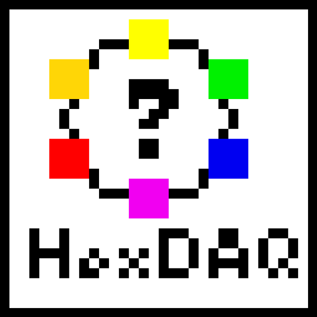

# HexDAQ

###  HGCAL sensor testing LabVIEW™ program

This is a program designed to steer the hardware on HGCAL sensor testing setups, record data in user-definable routines and store them. It is interfaced to [HexPlot](https://gitlab.cern.ch/CLICdp/HGCAL/HGCAL_sensor_analysis) for display of recorded data in geometrical shapes.

For a documentation of wafer loading procedures see [here](info/wafer_loading.md).


## About this Readme
The following lists some advice and features to implement as well as already implemented features, but is not intended to document the entire program. Every VI has a documentation string attached, which shows up when hovering with the mouse and activating the help window (ctrl + h). HexDAQ is implemented as a LabVIEW™ state machine. If you do not know what this is, read it up before trying to understand the implementation.


## Installation:

HexDAQ is developed and tested on Windows. Some features are Windows specific and will not work on an other OS.
* make sure you have `VI properties> Execution> "Execution system: user interface"` enabled

### Dependencies
* LabVIEW™ 2016 (32 bit): 64 bit will fail loading dlls. Older versions do not have the channel features, which allow data exchange between loops. LabVIEW™ 2017 is not backwards compatible.
* drivers: The instrument drivers required for this program to run are distributed in the archive `instr.lib.zip`. Place the content of into the `instr.lib` directory of your LabVIEW™ installation (something like `C:\Program Files (x86)\National Instruments\LabVIEW 2016\instr.lib`) to make LabVIEW™ aware of them.
* [notepad.exe](https://notepad-plus-plus.org) for the "Open after execution" functionality
* [HexPlot.exe](https://gitlab.cern.ch/CLICdp/HGCAL/HGCAL_sensor_analysis) for the "Plot after execution" functionality
* [ROOT](https://root.cern.ch/building-root) (HexPlot uses Root libraries, so make sure you have Root 5 (Root 6 is not windows compatible) installed)
* [Acrobat Reader(TM)](https://get.adobe.com/reader/) for embedded PDF view
* [Sensirion SHT1x/7x](https://www.digikey.com/en/product-highlight/s/sensirion/ek-h5-eval-kits) for the Sensirion SHT1x/7x sensors. In case drivers in instr.lib.zip are not enough, install software Viewer Software Humidity Evaluation Kit EK-H5 ([link to download website](https://www.sensirion.com/en/environmental-sensors/humidity-sensors/evaluation-kits-ek-h5/)).
* [FTDI driver](http://www.ftdichip.com/Drivers/D2XX.htm) for communication via Virtual COM Port (VCP). [Installation script](http://www.ftdichip.com/Drivers/CDM/CDM21228_Setup.zip) on the same page.


## Naming conventions
* All VIs are lower-case
* All VIs except the main VI are in a separate virtual folder
* All type definitions are in a separate virtual folder
* VIs are given a prefix depending on their function:
  * top - any VI which is directly referenced in the main
  * sub - any sub-level VI which is not on top level and not part of any other category
  * IV - VI specific for IV measurements
  * CV - VI specific for CV measurements
  * source - VI specific for handling the source meter
  * switchboard - VI specific for handling the switch board
  * env - VI specific for dealing with environmental data
  * util - helper VI not specific to the project


## Development of HexDAQ

### Contributing
Feel free to give feedback, report issues or request changes. Contributions and merge requests are welcome as well!

#### Useful software
Install [LabViewGitEnv](https://github.com/joerg/LabViewGitEnv) to integrate the LabVIEW™ diff and merge tools into git. 

You can change the options of LVCompare to get rid of unwanted diffs by attaching the limitations to file path of LVCompare in "LVCompareWrapper.sh". 
For example:
```
"${LabViewShared}/LabVIEW Compare/LVCompare.exe" "${LOCAL}" "${REMOTE}" "-lvpath" "${LabViewBin}" "-nofppos" "-nobdpos" "-nobdcosm"
```
LVCompare Options:
* `-noattr` skip VI attributes
* `-nofp` skip front panels
* `-nofppos` skip the size or position of front panel objects.
* `-nobd` skip block diagrams
* `-nobdcosm` skip the appearance of block diagram objects.
* `-nobdpos` skip the size or position of block diagram objects.


#### Branches
Please follow these conventions to make contributions smooth:
* base your branch on the protected `develop` branch
* follow the [naming conventions](#naming-conventions)
* include any new device drivers you use in instr.lib.zip with separate folders for original drivers and custom modified drivers
* open up a `WIP:` (Work In Progress) pull request (PR) to discuss changes and implementations on the way
* before submitting the final PR rebase on the `develop` branch and make sure everything runs as expected

### Contributors
The following authors, in alphabetical order, have contributed to HexDAQ:

* Erica Brondolin, CERN, @ericabro
* Itamar Levy, TAU, @itlevy
* Andreas Alexander Maier, CERN, @amaier
* Florian Michael Pitters, CERN, TU Vienna, @fpipper
* Thorben Quast, CERN, RWTH Aachen, @tquast
* Eva Sicking, CERN, @esicking
* Manfred Valentan, HEPHY, @valentan

HexDAQ was initially developed by:

* Andreas Alexander Maier, CERN, @amaier

It is currently maintained by:

* Erica Brondolin, CERN, @ericabro
* Thorben Quast, CERN, RWTH Aachen, @tquast

